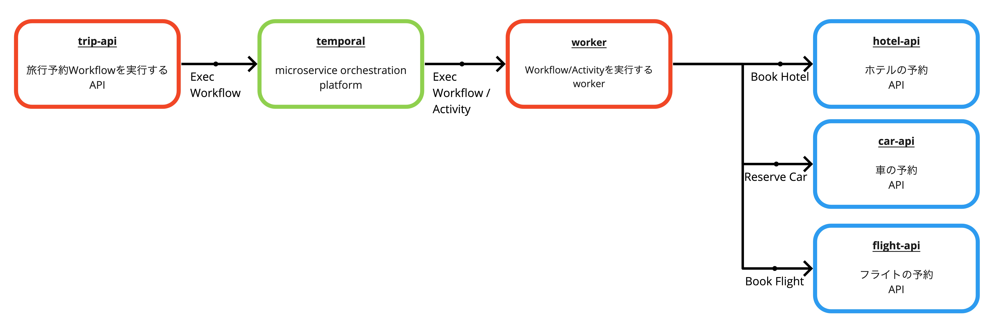
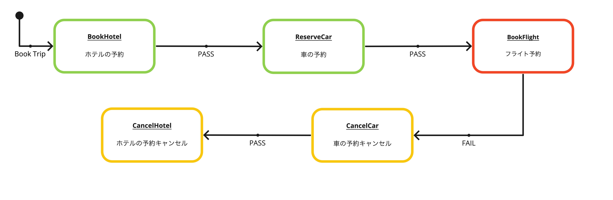

# Saga example: trip booking

- https://github.com/temporalio/samples-java/tree/master/src/main/java/io/temporal/samples/bookingsaga
    - https://github.com/berndruecker/trip-booking-saga-java

## run

```bash
docker-compose up -d --build
```

```bash
curl localhost:3000/book
```

- temporal web ui
  - http://localhost:8088

## services




